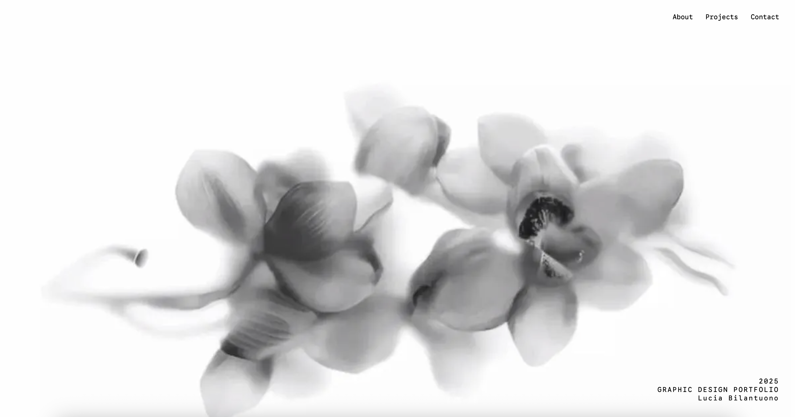
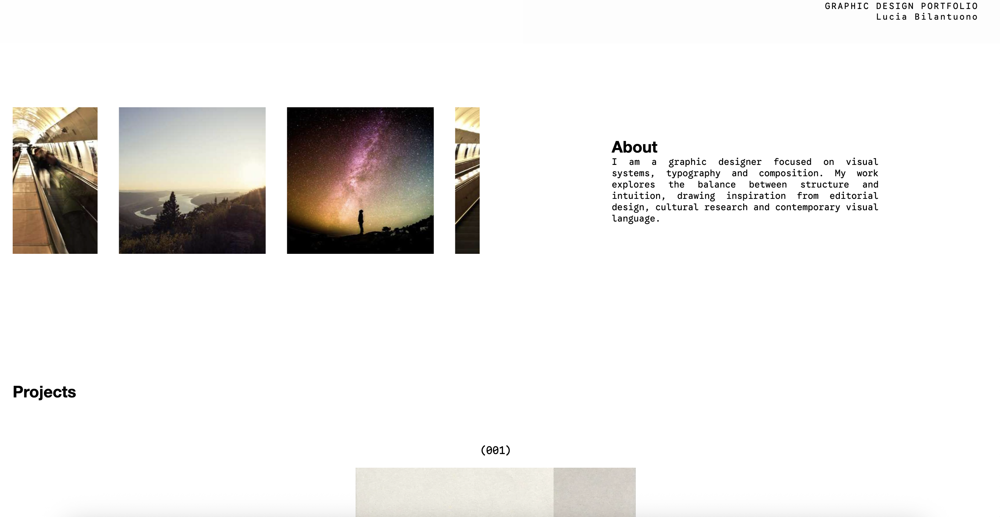
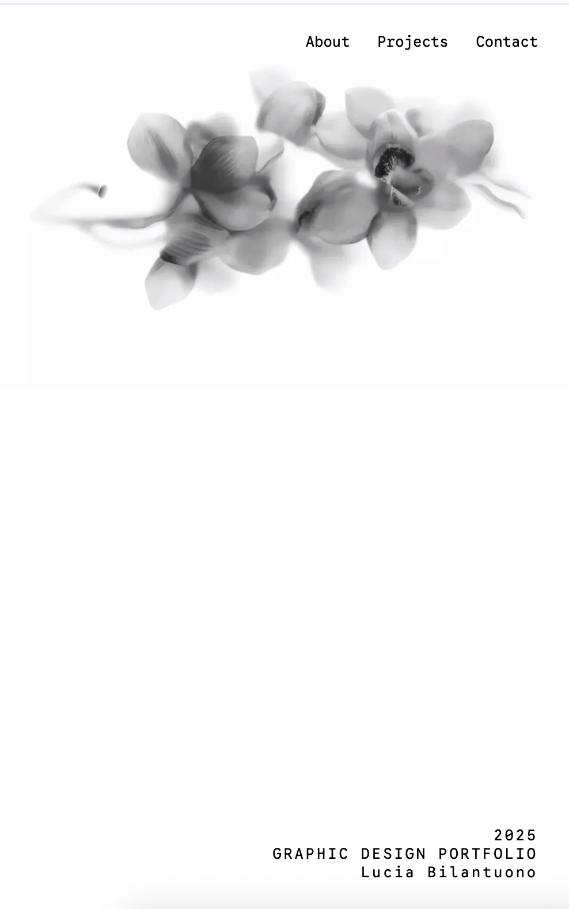

# Graphic Design Portfolio — Reusable Template

🔗 **Live Deployment:**  
👉 https://luciabilantuono.github.io/PortfolioTemplate/  
*(Replace or update this link if needed)*

---

## Project Description & Purpose

This project is a **reusable graphic design portfolio template** built with the goal of creating a strong, adaptable foundation rather than a one-off website.

Instead of focusing on a static portfolio, the project emphasizes **structure, scalability, and design systems**, allowing it to be easily reused, customized, or forked for future personal projects or client work. The design language is inspired by **editorial layouts, fashion portfolios, and gallery-style presentations**, translating print design principles into a digital environment.

The template demonstrates professional standards in layout, interaction, and code organization while maintaining a clean and expressive visual identity.

---

## Tech Stack Used

- **HTML5** — Semantic structure and accessible markup  
- **CSS3** — Layout systems, responsive design, transitions, and 3D transforms  
- **Vanilla JavaScript (ES6)** — Interactivity and hover-based animations  
- **No frameworks or build tools** — Lightweight, portable, and easy to maintain  

---

## Customization Guide

Replace Images

All images currently use placeholder URLs.
You can replace them by editing the src attributes directly in index.html.

Update Text Content

Hero title, year, and name → Hero section

About text → About section

Project titles and descriptions → Projects section

Footer links and contact information → Footer

Add or Remove Projects

Each project is structured as a square flip card.
To add a new project, duplicate a .project-item block in the Projects section and update the image and text content.

Styling Adjustments

Global styles → styles.css

Typography → styles.css (font-family definitions)

Animations & interactions → script.js
 
 ——————————————————————————————————————————————————————-


## Credits & Acknowledgments

Design & Development: Lucia Bilantuono

Fonts:

- Google Sans Code

- Cal Sans (with system fallbacks)

Placeholder Images: Used during development for layout and testing purposes


## Setup Instructions for Local Development

To run this project locally:

1. Clone the repository:
   ```bash
   git clone https://github.com/Luciabilantuono/PortfolioTemplate.git


## SCREENSHOTS






## Notes

## This project was developed as part of an academic assignment focused on web layout and style sheets, with an emphasis on semantic HTML, responsive design, and reusable architecture. It is intended to evolve over time rather than remain a static portfolio.